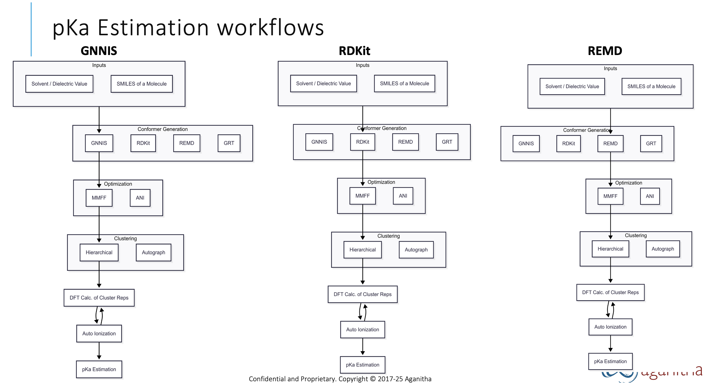
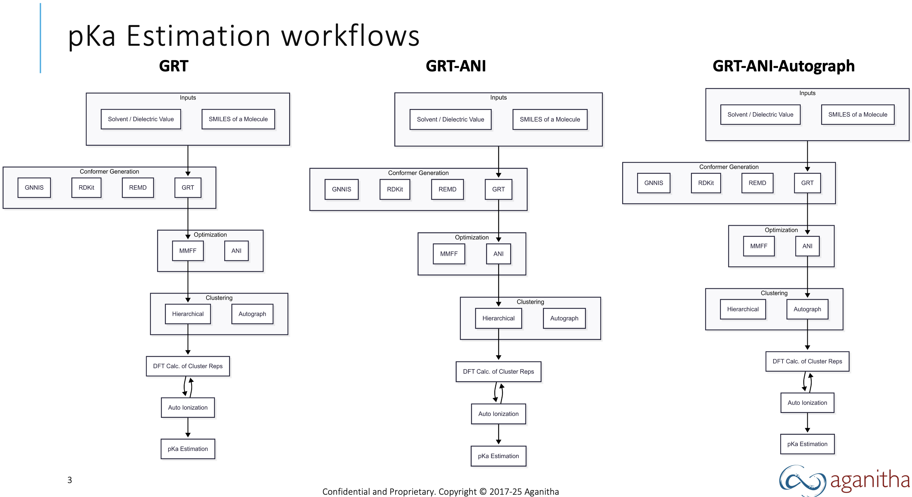

# Automated pKa Estimation Pipelines

This repository provides a modular platform that integrates advanced cheminformatics and deep learning tools to automate molecular conformer generation and pKa estimation leveraging quantum mechanical methods.

---

## Major Dependencies

- **[RDKit](https://www.rdkit.org/):** For molecular conformer generation and cheminformatics operations.
- **[GPU4PySCF](https://github.com/pyscf/gpu4pyscf):** GPU-accelerated PySCF, used for DFT calculations including solvation energy and pKa predictions.
- **[GNNIS](https://github.com/rinikerlab/GNNImplicitSolvent):** Graph Neural Network-driven conformer generator for stable structures in solvents.
- **[GROMACS](https://www.gromacs.org/):** Performs molecular dynamics simulations and conformer refinement (e.g., REMD).
- **[Torsional Diffusion](https://github.com/proteinsolver/torsional-diffusion):** Generative model for torsion angle sampling and diverse conformer exploration.
- **[ANI](https://github.com/aiqm/torchani):** Machine learning potentials for accurate quantum properties.
- **[Autograph](https://github.com/TanemuraKiyoto/AutoGraph):** For structural clustering and post-processing.

---

## Folder Structure & Pipeline Overview

| Pipeline Name      | Folder Name                | Description                                                                    |
|--------------------|---------------------------|--------------------------------------------------------------------------------|
| REMD               | `md_conformers`           | MD-based conformer generation via Replica Exchange Molecular Dynamics (REMD).   |
| RDKit              | `MolConSul`               | RDKit conformer generation via the MolConSul framework.                         |
| GRT                | `TD_GNNIS_RDKit`          | Integrated GNNIS + RDKit + Torsional Diffusion methodology.                     |
| GNNIS              | `GNNIS`                   | Deep neural network-based initial structure generator.                          |
| GRT-ANI            | `GRT_with_ANI_autograph`  | GRT pipeline refined with ANI ML potentials.                                    |
| GRT-ANI-Autograph  | `GRT_with_ANI_autograph`  | GRT-ANI pipeline with structural clustering using Autograph.                    |

---

## All pipelines can be executed via the available Docker container: dockerhub.aganitha.ai:4443/chem/pka_pipeline:ovh5

---

## Pipelines Overview

# pka-cli
